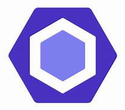

## Enhance Efficiency
Coding standards are very important for programmers and readers because they can understand easily and faster. For example, when I reviewed my code that doesn’t follow the rules such as proper naming and using useful comments, I felt that I have to rewrite it again to understand how I coded because my code is so messy, which is really waster time due to poor coding. Thus, a clear code can enhance efficiency and reduce the mistake that you code.
## For Teamwork 
As we all know, people like to read a clear and concise article, and code is like an article. If the code looks good, readers will be more likely to read your code and want to work with you on the project. Therefore, a good coding style is important for programmers. In addition, we can easily and quickly understand a new programming language through coding standards, because we can do not need to waste time to correct coding style errors.
## The benefits of ESLint
After using the ESLint within IntelliJ, I feel that which is an excellent way to help us to make code more readable and clear. Even though there are some errors about coding standards when I code, which make me uncomfortable and even want to stop coding to fix it, but I try to code the whole program, then to solve the warnings that begin with ESLint. In addition, ESLint can automatically notify me that there have syntax errors and stylistic issues, which help me to make my code more readable and easy to understand. However, I have to download those three files such as .eslintrc in every new project  and run it in the terminal. Maybe I am not familiar with how to configuring ESLint, so something there are some issue happens in this process. In general, ESLint can code more readable, which is beneficial for teamwork in the future. 

