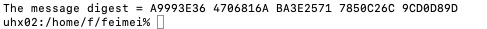

<div class="ui small rounded images">
  
</div>

This another project that I took ICS class in KCC is SHA-1.  My professor allowed us to Choose C language or C++ language to code. C language is the first programming language that I learn, so I chose it to code this assignment. I spent much more time to read and understand the file about SHA-1 than programming because I am not good at English. I have to read it carefully and even translate it into Chinese when I cannot understand it. However, after knowing what the file that my professor Lisa share, I was not afraid to code it and finish it before the deadline. The Secure Hash Algorithm 1 is a cryptographic computer security algorithm. It was created by the US National Security Agency in 1995, and it is part of the Digital Signature Algorithm or the Digital Signature Standard (DSS). The purpose of SHA -1 is that producing a 160 bits hash value or message digest from the inputted data. In addition, I fell curiosity about using bitwise operators that I rarely use it. In general, this project was not hard, but it took a lot of time to read and understand this project’s file. 


Here is some code about bitwise operators:

```js
// convert your array of unsigned characters into an equivalent array of unsigned integers
void convertCharArrayToIntArray(unsigned char buffer[], unsigned int message[], unsigned int sizeOfFileInBytes){
        unsigned int mask = 0x80000000;
        unsigned int i = 0, j =0;
        while(sizeOfFileInBytes >= i){
                mask = mask << 8 | buffer[i];
                mask = mask << 8 | buffer[++i];
                mask = mask << 8 | buffer[++i];
                mask = mask << 8 | buffer[++i];
                message[j] = mask; 
                i++; 
                j++;
        }       
        if(DEBUG){
                for(i = 0; i < j; i++){
                        printf("message[%d] = %08X\n", i, message[i]);
                
                        }
                }
                        
                                                             
}

```
If you would like the complete code, send an email to feimei@hawaii.edu.


