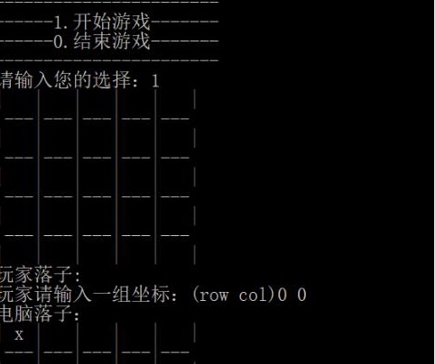

Coding a gobang game was my first project. It was a simple and interesting project because I liked to play gobang with my friends since I was a child. Therefore, I really happy to code this project. In this project, I code a chessboard first, then player chose their location. If five chess pieces in a line, the game should be terminated and print the winner’s name. However, this game only works in the black window, so I cannot play it with my friend who is not an ICS student.  Therefore, So I realized that I should learn more knowledge about programming in order to make a perfect game, such as having a good user interface and using a picture to make a bigger chessboard.

 
